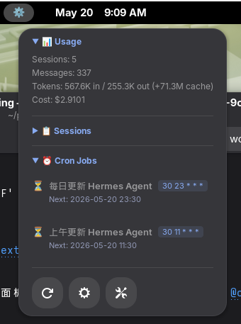

# Hermes Monitor — GNOME Shell Extension

🐺 Monitor [Hermes Agent](https://github.com/Leos-byte/Leos) scheduled tasks (cron jobs) directly from the GNOME top panel. One click to view all jobs — another click to see real-time execution logs.



## Features

- **Panel indicator** — sits in the top bar, shows running job count
- **Job list popup** — click the icon to see all scheduled cron jobs with status, schedule, and next-run time
- **Log viewer** — click any job to open a modal with the last 60 lines of execution logs
- **Auto-refresh** — configurable interval (default 30 seconds)
- **Settings** — adjustable refresh rate, Hermes home path, and panel position via GNOME Settings

## Requirements

- GNOME Shell 45–50
- **Hermes Agent** installed with cron jobs configured
- Python 3.10+

## Install

```bash
# From this repo
make install

# Or manually
cp -r . ~/.local/share/gnome-shell/extensions/hermes-monitor@leo/
gnome-extensions enable hermes-monitor@leo
```

Then restart GNOME Shell: `Alt+F2` → `r` → `Enter`

## Settings

Open **GNOME Settings → Extensions → Hermes Monitor** to configure:

| Setting | Default | Description |
|---------|---------|-------------|
| Refresh interval | 30 s | How often to poll Hermes for job updates |
| Hermes home | `~/.hermes` | Path to Hermes config directory |
| Panel position | right | Where to place the indicator (left/center/right) |

## Project Structure

```
hermes-gnome-extension/
├── extension.js          # Main extension logic
├── prefs.js              # GNOME Settings preferences
├── metadata.json         # Extension metadata
├── stylesheet.css        # Panel and dialog theming
├── schemas/              # GSettings schema
├── src/hermes-status.py  # Data provider (reads Hermes cron data)
├── icons/                # Extension icons
└── locale/               # Translations (TODO)
```

## License

MIT — see [LICENSE](LICENSE)
